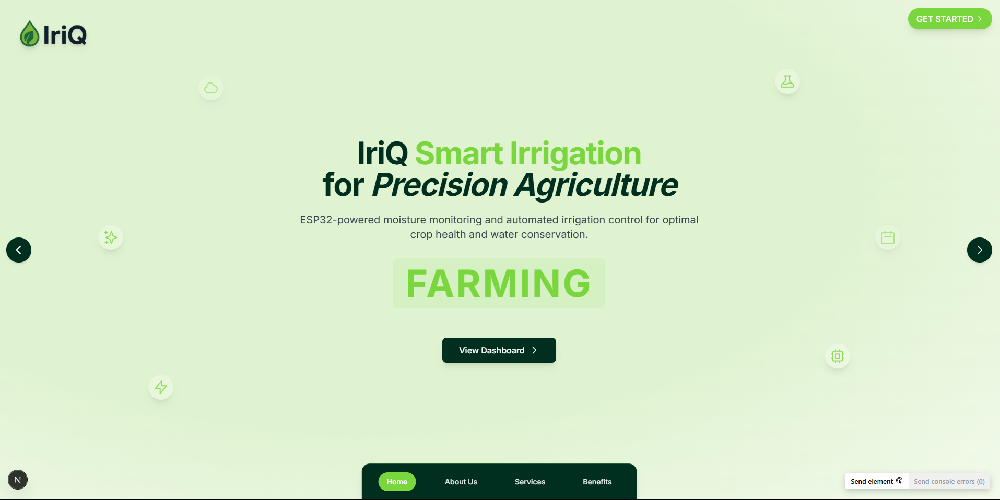

# IriQ Smart Irrigation System



IriQ is a comprehensive smart irrigation solution that combines ESP32 microcontrollers, soil moisture sensors, and a modern web dashboard to optimize water usage and improve crop yields through precision agriculture.

## 🌱 Project Overview

IriQ is designed to revolutionize agricultural irrigation through intelligent automation and real-time monitoring. The system consists of:

1. **ESP32-based Hardware** - Microcontroller with WiFi connectivity, soil moisture sensors, and relay-controlled pump system
2. **Cloud Backend** - Supabase PostgreSQL database with real-time subscriptions
3. **Web Dashboard** - Modern Next.js application with responsive design for monitoring and control

## 🚀 Features

### Real-time Moisture Monitoring
- Continuous soil moisture monitoring with capacitive sensors
- Historical data visualization with interactive charts
- Customizable alert thresholds

### Automated Pump Control
- Manual and automatic irrigation modes
- Moisture threshold-based watering
- Relay verification for reliable operation
- Fail-safe mechanisms

### Cloud Dashboard
- Responsive web interface accessible from any device
- Real-time data updates via Supabase subscriptions
- Secure user authentication
- Intuitive controls for system management

### Remote Management
- Control your irrigation system from anywhere
- Real-time status updates and notifications
- User-friendly interface

## 💧 Benefits

### Resource Optimization
- Reduce water consumption by up to 40%
- Minimize energy usage through intelligent pump control
- Lower operational costs

### Enhanced Productivity
- Maintain optimal soil moisture levels
- Reduce plant stress through consistent watering
- Make data-driven agricultural decisions

### Reliability & Security
- Multiple fail-safe mechanisms
- Secure authentication
- Robust error handling

## 🔧 Technical Architecture

### Hardware Components
- ESP32 microcontroller
- Capacitive soil moisture sensors
- Relay module for pump control
- Power supply system

### Software Stack
- **Frontend**: Next.js, React, TailwindCSS, Recharts
- **Backend**: Supabase (PostgreSQL, Auth, Realtime)
- **Firmware**: Arduino/C++ for ESP32

## 🚀 Getting Started

### Dashboard Setup

1. Clone the repository
   ```
   git clone https://github.com/yourusername/iriq.git
   cd iriq/iriq-dashboard
   ```

2. Install dependencies
   ```
   npm install
   ```

3. Create a `.env.local` file with your Supabase credentials
   ```
   NEXT_PUBLIC_SUPABASE_URL=your-supabase-url
   NEXT_PUBLIC_SUPABASE_ANON_KEY=your-supabase-anon-key
   ```

4. Start the development server
   ```
   npm run dev
   ```

### ESP32 Setup

1. Open the Arduino IDE
2. Install required libraries:
   - ArduinoJson
   - HTTPClient
   - WiFi
   - ESP32 board support

3. Open the `IriQ_ESP32_Firmware.ino` file
4. Update WiFi credentials and Supabase API keys
5. Upload to your ESP32 device

## 📊 Dashboard Components

- **System Status**: Overview of system health and connectivity
- **Device Status**: Real-time status of connected ESP32 devices
- **Pump Control**: Manual control interface for irrigation pumps
- **Moisture Monitor**: Current soil moisture readings
- **Moisture History**: Historical data visualization with interactive charts

## 🛠️ Project Structure

```
iriq/
├── esp32-firmware/           # ESP32 Arduino code
│   └── IriQ_ESP32_Firmware/  # Main firmware project
│       ├── IriQ_ESP32_Firmware.ino  # Main Arduino sketch
│       ├── sensors.cpp        # Sensor handling code
│       ├── sensors.h          # Sensor header file
│       ├── supabase_api.cpp   # Supabase API integration
│       └── supabase_api.h     # API header file
│
└── iriq-dashboard/           # Next.js web dashboard
    ├── public/               # Static assets
    ├── src/                  # Source code
    │   ├── app/              # Next.js app directory
    │   │   ├── dashboard/    # Dashboard page
    │   │   ├── login/        # Authentication page
    │   │   └── page.tsx      # Landing page
    │   ├── components/       # React components
    │   │   └── dashboard/    # Dashboard components
    │   └── lib/              # Utility functions
    ├── package.json          # Dependencies
    └── tailwind.config.js    # TailwindCSS configuration
```

## 🔒 Security Considerations

- All API keys are stored in environment variables
- User authentication is handled by Supabase
- HTTPS is used for all API communications
- ESP32 firmware includes verification for critical operations

## 📝 License

This project is licensed under the MIT License - see the LICENSE file for details.

## 🙏 Acknowledgements

- [Next.js](https://nextjs.org/)
- [Supabase](https://supabase.io/)
- [TailwindCSS](https://tailwindcss.com/)
- [Recharts](https://recharts.org/)
- [ESP32 Community](https://esp32.com/)

---

Developed with 💚 by [Your Name]
